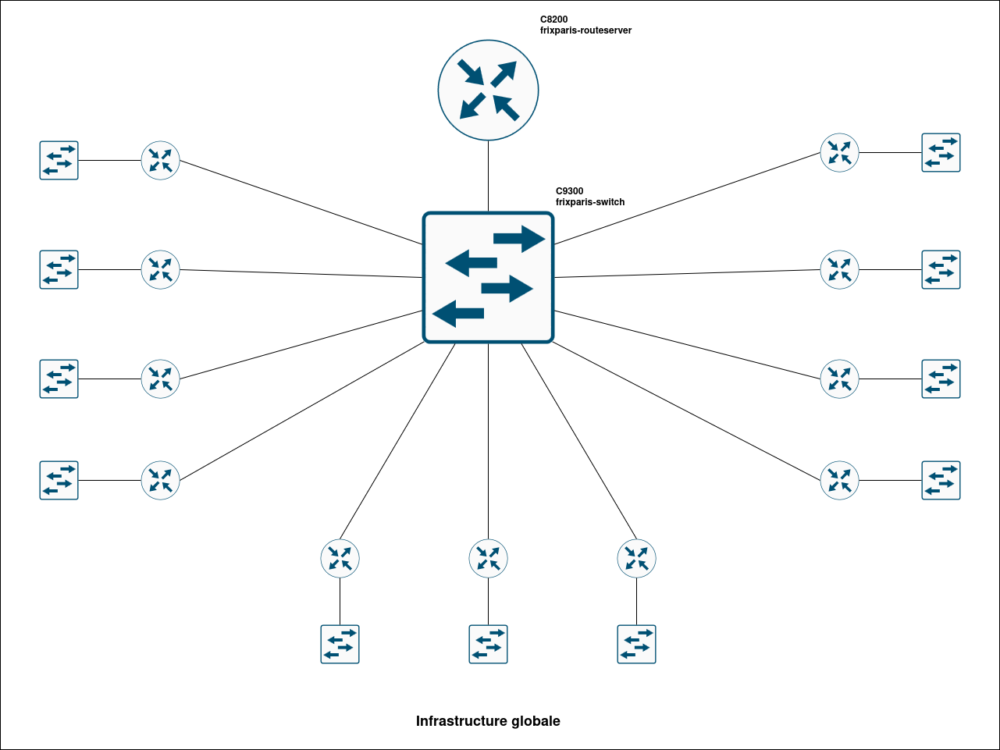
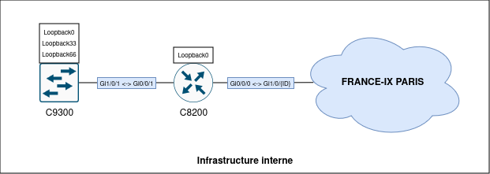

# RE20 - TP Peering

Sujet de TP pour l'Unité d'Enseignement RE20 "Réseaux d'Opérateurs", enseigné à l'Université de Technologie de Troyes (UTT) durant le semestre de printemps.

Ce sujet est écrit par Arnaud GORCE, vacataire pour l'UTT dans le cadre de l'UE RE20 pour le semestre P26 et actuellement ingénieur NetOps chez [France-IX](https://www.franceix.net/).

---

## Sommaire

1. [Introduction](#introduction)
2. [Matériel à disposition](#matériel-à-disposition)
3. [ASN et préfixes IP par binôme](#asn-et-préfixes-ip-par-binôme)
4. [Déroulement du TP](#déroulement-du-tp)
    1. [Partie 1 - Infrastructure interne](#partie-1---infrastructure-interne)
    2. [Partie 2 - Peering via route-server](#partie-2---peering-via-route-server)
    3. [Partie 3 - Peering via sessions bilatérales](#partie-3---peering-via-sessions-bilatérales)
    4. [Partie 4 - Customisation des configurations eBGP](#partie-4---customisation-des-configurations-ebgp)
        1. [AS-Path filtering](#41---as-path-filtering)
        2. [AS-Path prepending](#42---as-path-preprending)

---

## Introduction

Un terme revient très souvent au sein de la communauté Internet et dans l'écosystème de l'interconnexion de données : le **peering**.

Traduit par le terme d'appairage en français, il consiste dans notre domaine à mettre en relation deux équipements réseaux pour qu'ils puissent partager des informations entre eux via un protocole défini au préalable (vous avez dit BGP ?).

Dans le cadre d'Internet, différents acteurs vont établir des sessions BGP entre eux afin d'échanger une information primordiale : des routes IP (v4 ou v6), afin de pouvoir ensuite les incorporer à leurs tables de routage et ainsi échanger du trafic. 

Au cours de cette séance de TP, vous incarnerez par binôme un acteur d'Internet (opérateur, fournisseur cloud, CDN, etc...) et aurez sous votre responsabilité un numéro d'AS et ainsi que plusieurs préfixes IP. Votre but sera de vous interconnecter à l'ensemble des autres acteurs incarnés par l'ensemble des participants à la séance à travers un Point d'Echange Internet (en anglais, Internet eXchange Point, abrégé IXP) afin que vous puissiez joindre l'ensemble des préfixes IP utilisés dans l'architecture de TP, tout en jouant sur différents paramètres du protocole BGP afin de découvrir et observer les mécanismes permettant l'optimisation du routage dans certains cas d'usage.


## Matériel à disposition et architecture

Pour ce TP, nous utiliserons les routeurs Cisco 8200 et les switchs L3 Cisco 9300. 

Chaque binôme aura à gérer une mini-infrastructure composée d'un routeur et d'un switch. Le routeur fera à la fois de l'eBGP et de l'iBGP tandis que le switch se contentera de l'iBGP. Un protocole IGP (IS-IS) sera configuré sur l'interconnexion point-à-point entre les deux. Le switch portera aussi des interfaces loopback avec des adresses IP appartenant aux préfixes IP du réseau que vous représentez.  

Un autre couple routeur-switch servira à simuler l'IXP : le switch servira à faire la mise en réseau de l'ensemble des routeurs utilisés pendant le TP et le routeur servira de "route-server".




## ASN et préfixes IP par binôme 

Les ASN et les préfixes IP indiqués dans le tableau ci-dessous sont issus des bases de données IRR (Internet Routing Registry) et correspondent à la réalité des allocations Internet au moment de l'écriture initiale de ce sujet de TP. 

Ceux-ci sont utilisés ici uniquement dans un contexte d'enseignement et dans un environnement de lab. 

| ID du binôme | Nom du réseau | ASN   | Préfixes IPv4                     | Préfixes IPv6                          |
| :----------: | :-----------: | :---: | :-------------------------------- | :------------------------------------- |
| 1            | OVHcloud      | 16276 | 5.196.0.0/16<br/> 37.59.0.0/16    | 2001:41d0::/32<br/> 2402:1f00::/32     |
| 2            | Scaleway      | 12876 | 51.15.0.0/16<br/> 62.4.0.0/19     | 2001:bc8::/32<br/> 2001:67c:26d8::/48  |
| 3            | Free SAS      | 12322 | 62.147.0.0/16<br/> 82.64.0.0/14   | 2a01:e00::/32<br/>  	2a01:e01::/32       |
| 4            | Bouygues      | 5410  | 31.32.0.0/13<br/> 128.78.0.0/15   | 2001:860::/29<br/> 2a04:cec0::/29      |
| 5            | Akamai        | 20940 | 2.16.0.0/13<br/> 92.122.0.0/15    | 2600:1400::/24<br/> 2a02:26f0::/32     | 
| 6            | Fastly        | 54113 | 146.75.0.0/17<br/> 185.31.16.0/22 | 2620:11a:c000::/40<br/> 2a04:4e40::/29 | 
| 7            | Microsoft     | 8075  | 1.186.0.0/16<br/> 172.128.0.0/11  | 2001:4898::/31<br/> 2603:1000::/24     |
| 8            | Apple         | 714   | 17.0.0.0/8<br/> 57.112.0.0/12     | 2a01:b747::/32<br/> 2620:149::/32      |
| 9            | Amazon        | 16509 | 3.0.0.0/10<br/> 34.192.0.0/10     | 2a13:88c0::/29<br/> 2001:67c:e0c::/48  |
| 10           | Cloudflare    | 13335 | 1.1.1.0/24<br/> 92.8.0.0/15       | 2606:4700::/32<br/> 2606:54c0::/28     | 
| 11           | Google        | 15169 | 8.8.8.0/24<br/> 142.250.0.0/15    | 2001:4860::/32<br/> 2604:31c0::/32     |

---

## Déroulement du TP 


### Partie 1 - Infrastructure interne

Dans la première partie du TP, vous allez devoir réaliser la configuration initiale de vos équipements ainsi que l'interconnexion entre les deux. 



Dans un premier temps, câblez le port `GigabitEthernet0/0/1` de votre routeur vers le port `GigabitEthernet1/0/1` de votre switch.  

Afin d'aller vite pour se concentrer sur la partie peering, prenez les templates `c8200_initial_config_{id}.cfg` et `c9300_initial_config_{id}.cfg` disponibles dans le dossier portant le nom de l'acteur d'Internet qui vous a été assigné (clique ici : [Configuration files](configuration_files/)) et appliquez-les sur les équipements.

Dans ces deux fichiers de configuration, vous retrouverez les éléments de configuration suivants : 
* hostname ;
* configuration du lien point-à-point entre les deux équipements (adressage IP inclus) ; 
* configuration du protocole IS-IS ; 
* configuration de l'interface `Loopback0` sur chaque équipement. 

Une fois la configuration appliquée sur chaque équipement, vérifiez les éléments suivants : 
* le port configuré chaque équipement est bien up -> `show interface description status` 
* le protocole IS-IS est bien fonctionnel -> `show isis topology` et `show isis database detail` 
* les adresses IP `Loopback0` peuvent se joindre entre elles (en v4 et en v6 !) -> `ping {ip_address}`

Ensuite, nous allons ajouter deux autres interfaces "Loopback" qui serviront à modéliser des "clients" au sein de votre réseau. Nous allons configurer sur ces interfaces des adresses IP appartenant aux préfixes IP publics de l'acteur d'Internet que vous représentez. Pour réaliser cela, prenez le template `c9300_loopbacks_config_{id}.cfg`.


### Partie 2 - Peering via route-server 

Maintenant que votre infrastructure interne est prête, il est l'heure de faire du **peering**.

Avant toute chose, vous allez câbler et configurer l'interface physique pour vous connecter au switch représentant le point d'échange Internet avec le template `c8200_peering_interface_config{id}.cfg`. (Pour le câblage sur le switch, prenez le numéro de port correspondant à votre ID).

Vous allez commencer par faire du peering sur le point d'échange Internet simulé via le route-server. Ainsi, via une seule session BGP (enfin, deux plus exactement car nous faisons à la fois de l'IPv4 et de l'IPv6), nous obtenons des routes de tous les autres réseaux aussi connectés au route-server.

Pour faire cela, vous allez utiliser le template `c8200_ebgp_rs_config_{id}.cfg`. 

Avant d'appliquer la configuration, regardons un peu son contenu. On trouve trois sections : 
* les entrées "prefix-list" ; 
* la configuration BGP ; 
* les entrées "route-map". 

Pourquoi utiliser une prefix-list et une route-map ? Ces deux entrées associées vont vous permettre de filtrer les annonces de routes que vous configurez via BGP. En faisant cela, vous n'annoncerez que les routes que vous possédez et que vous êtes en droit d'annoncer à d'autres acteurs d'Internet qui ne seraient pas vos clients. Ainsi, vous éviterez de créer des remous dans la table de routage globale et de devoir router du trafic qui n'est pas lié à votre infrastructure.

Une fois la configuration appliquée, vérifiez les éléments suivants : 
* état des sessions BGP -> `show bgp neighbor 37.49.236.250` et `show bgp neighbor 2001:7f8:54::250`
* état de la table de routage BGP -> `show ip bgp` (commande à faire sur les deux équipements)
* état de la table de routage globale -> `show ip route` (commande à faire sur les deux équipements)


### Partie 3 - Peering via sessions bilatérales

Certains acteurs connectés à des IX choisissent d'établir aussi des sessions BGP directes avec d'autres acteurs présents sur le même IX qu'eux (on qualifie souvent ces sessions de "bilatérales").

Vous utiliserez dans cette partie les deux autres préfixes IP (v4 et v6) qui vous sont attribués.

Pour le reste de cette partie, vous allez devoir établir des sessions BGP avec les autres ASN utilisées au cours de ce TP, mais cette fois-ci, pas de template ou d'indication claire, choisissez et échangez entre vous pour faire les configurations, établir les sessions et échanger les routes ! 

Bon courage et happy peering ! 

_Note : vous n'êtes pas obligés d'établir des sessions avec TOUS les autres acteurs, essayez d'en avoir au moins 3._


| ID du binôme | Nom du réseau | ASN   | Adresse IPv4 sur France-IX Paris | Adresse IPv6 sur France-IX Paris |
| :----------: | :-----------: | :---: | :------------------------------- | :------------------------------- | 
| 1            | OVHcloud      | 16276 | 37.49.236.100                    | 2001:7f8:54::100                 |
| 2            | Scaleway      | 12876 | 37.49.237.27                     | 2001:7f8:54::1:27                |
| 3            | Free SAS      | 12322 | 37.49.238.63                     | 2001:7f8:54::2:63                |
| 4            | Bouygues      | 5410  | 37.49.236.63                     | 2001:7f8:54::63                  |
| 5            | Akamai        | 20940 | 37.49.236.168                    | 2001:7f8:54::168                 | 
| 6            | Fastly        | 54113 | 37.49.238.76                     | 2001:7f8:54::2:76                |
| 7            | Microsoft     | 8075  | 37.49.236.5                      | 2001:7f8:54::5                   |
| 8            | Apple         | 714   | 37.49.237.176                    | 2001:7f8:54::1:176               |
| 9            | Amazon        | 16509 | 37.49.236.118                    | 2001:7f8:54::118                 |
| 10           | Cloudflare    | 13335 | 37.49.237.49                     | 2001:7f8:54::1:49                |
| 11           | Google        | 15169 | 37.49.236.2                      | 2001:7f8:54::2         


### Partie 4 - Customisation des configurations eBGP

Au cours de la partie 4 de ce TP, nous allons rapidement voir deux techniques permettant de faire des ajustements au niveau des annonces BGP afin de pouvoir optimiser le routage dans certains contextes : 
* l'AS-Path filtering ; 
* l'AS-Path preprending.


#### 4.1 - AS-Path filtering 

Le but de l'"AS-Path filtering" est de filtrer les routes reçues via une session BGP en se basant sur la composition de l'AS-Path des routes BGP.

C'est une façon très simple pour éviter d'envoyer du trafic vers un autre acteur via un chemin non optimisé ou un lien réseau trop chargé. 

L'exemple imaginé dans le cadre de ce TP est très simple : vous ne voulez plus recevoir les routes IPv4 et IPv6 envoyées par Google AS15169 via les route-servers. 

Vous allez donc devoir réaliser cela à l'aide du snippet de configuration suivant et des configurations déjà en place avec les templates fournis précédemment.

```
!
ip as-path access-list 1 seq 5 deny _15169_ 
ip as-path access-list 1 seq 10 permit .* 
! 
route-map rm-FILTER_DENY_15169 permit 10
 match as-path 1
!
```


#### 4.2 - AS-Path preprending

Lorsque BGP reçoit différentes routes pour le même préfixe IP, il effectue lui-même la sélection de la meilleure. 

Pour faire cela, le protocole suit un algorithme précis en se basant sur différents critères (pour plus de détails, voir [cet article de Cisco](https://www.cisco.com/c/en/us/support/docs/ip/border-gateway-protocol-bgp/13753-25.html) ou [cet article de Juniper](https://www.juniper.net/documentation/us/en/software/junos/vpn-l2/bgp/topics/concept/routing-protocols-address-representation.html)).

L'un des critères regardés est la longueur de l'AS-Path, c'est-à-dire la liste des AS traversés pour atteindre la destination via cette route IP. Plus l'AS-Path est long, moins la route est prioritaire. Et parfois, rendre des routes qu'on annonce soi-même aux autres moins prioritaire est très pratique, notamment pour déprécier certains chemins que les autres acteurs pourraient utiliser pour router du trafic à destination de votre réseau. 

Pour faire cela, il est possible d'utiliser la technique de l'"AS-Path prepending" (parfois abrégé "prepend"). Le but est très simple : on va rallonger manuellement l'attribut AS-Path de notre route IP en répétant plusieurs fois notre propre numéro d'AS dedans.

Vous allez donc devoir réaliser cela à l'aide du snippet de configuration suivant et des configurations déjà en place avec les templates fournis précédemment.

```
!
route-map rm-PREPEND_VIA_RS permit 10 
 set as-path prepend {local_as} {local_as}
! 
```


--- 

## Pour les curieux

### Génération des configurations 

Pré-requis : avoir installer Poetry (voir https://python-poetry.org/docs/#installation).

Ensuite : 
```
poetry install
poetry shell 
cd scripts/
python config_generator.py
```

### Ressources

* https://www.cisco.com/c/en/us/support/ios-nx-os-software/ios-xe-17/products-installation-and-configuration-guides-list.html
* https://www.cisco.com/c/en/us/td/docs/routers/ios/config/17-x/ip-routing/b-ip-routing/m_irs-ovrvw-cf.html
* https://www.cisco.com/c/en/us/td/docs/routers/ios/config/17-x/ip-routing/b-ip-routing/m_irg-route-server.html 
* https://www.cisco.com/c/en/us/td/docs/routers/ios/config/17-x/ip-routing/b-ip-routing/m_irg-external-sp-0.html

* https://blog.stephane-robert.info/docs/developper/programmation/python/jinja/#utilisation-des-templates-dans-le-code-python
* https://jinja.palletsprojects.com/en/stable/templates/ 

